### mms/mms.cfg

#### MCU Configuration

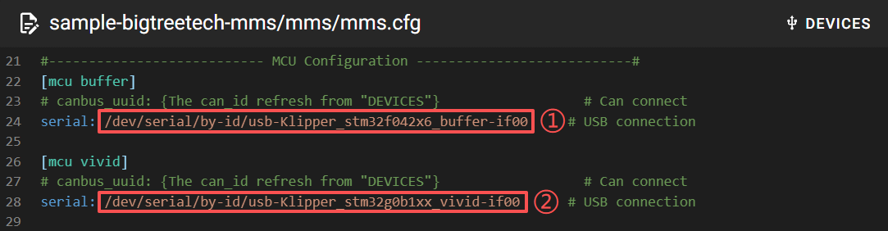

To complete the configuration, enter the device’s serial ID in the following fields:

 `1: Buffer` 
 
 `2: ViViD`
 
You can obtain these serial IDs using either of the following methods.

* Method One - Query via SSH: Run the following command in an SSH terminal:

    IDs containing `stm32f042x6_buffer` correspond to `Buffer`

    IDs containing `stm32g0b1xx_vivid`correspond to ` ViViD`.

    ```
    ls /dev/serial/by-id/*
    ```

    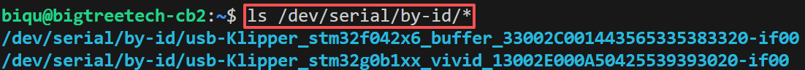

* Method Two - Check in Mainsail
    
    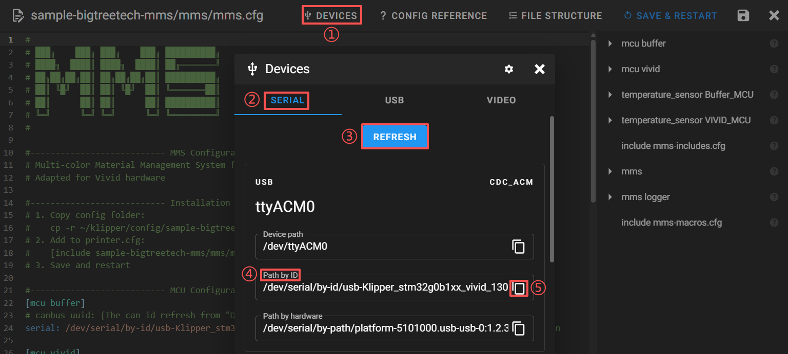

    * `1: DEVICES` 
    * `2: SERIAL`: Open the serial ID list.
    * `3: REFRESH`: Rescan available devices.
    * `4: Path by ID`: IDs containing `stm32f042x6_buffer` correspond to `Buffer`, IDs containing `stm32g0b1xx_vivid`correspond to ` ViViD`.
    * `5`: Copy the ID and paste it into the corresponding configuration entry.

#### MCU Temperature

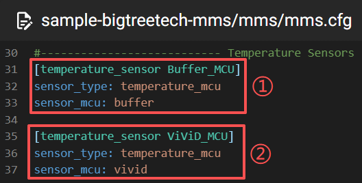

`1` and `2` represent the MCU temperatures of Buffer and ViViD, respectively.

Once enabled:

- Temperatures are displayed in Mainsail and KlipperScreen

- Real-time temperatures are logged by Klipper for troubleshooting

> Do not modify this section unless you fully understand its purpose.

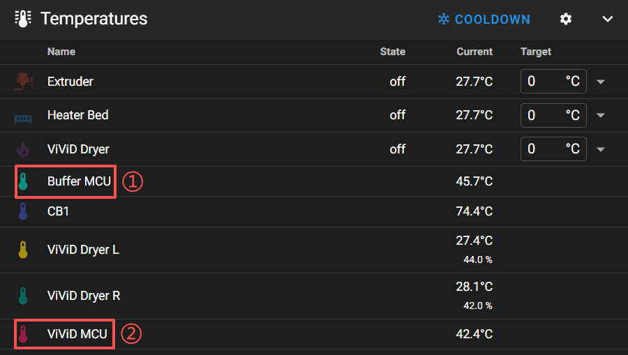

#### Module Includes


This section includes and enables all ViViD sub-modules. Do not modify this section or the contents of `mms-includes.cfg`

#### MMS Main Settings

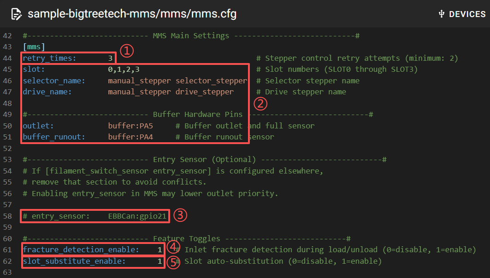

* 1: ViViD Task Retry Limit - Defines the number of times a ViViD task is retried after a failure.
 **Example**:
When loading filament from `Inlet to Gate`, if the feed distance exceeds the maximum limit and the Gate sensor is not triggered, the task fails and is retried. If retries exceed `retry_times` and recovery still fails: The task is aborted (if printing, ViViD issues a `pause print` command) and an error message is generated for diagnostics. After resolving the issue, the task can be resumed.
* 2: Hardware Mapping - Defines the physical hardware mapping for ViViD. **Do not modify this section.**
* 3: Entry Sensor - Typically installed just above the extruder gear, it detects when filament reaches the top of the extruder.

    **Strongly recommended to install and enable.**

    To enable it, remove the leading `#` and space, then set the correct pin (for example, `EBBCan:gpio21`).
 
* 4: Filament Runout Detection - Continuously monitors the Inlet sensor and immediately pauses printing when the active slot runs out of filament.
* 5: Automatic Filament Substitution - When filament runs out during printing, the system automatically switches to the slot defined by `substitute_with` in `mms-slot.cfg`

 (**Note:** Requires `fracture_detection_enable`to be enabled).

#### MMS Logger Configuration

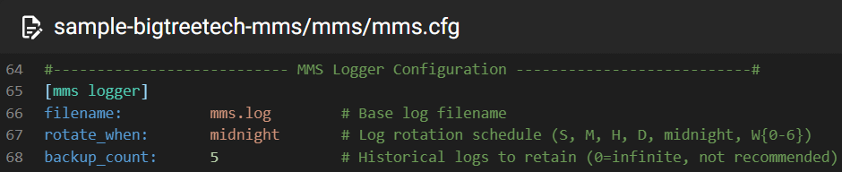

Controls the logging behavior of the MMS. By default, it follows Klipper's standard logging format and settings. This section should not be modified unless you fully understand the impact of the changes.

#### Macros Includes

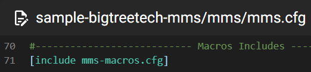

Includes all ViViD macro command definitions.

### base/mms-cut.cfg

#### [mms cut]

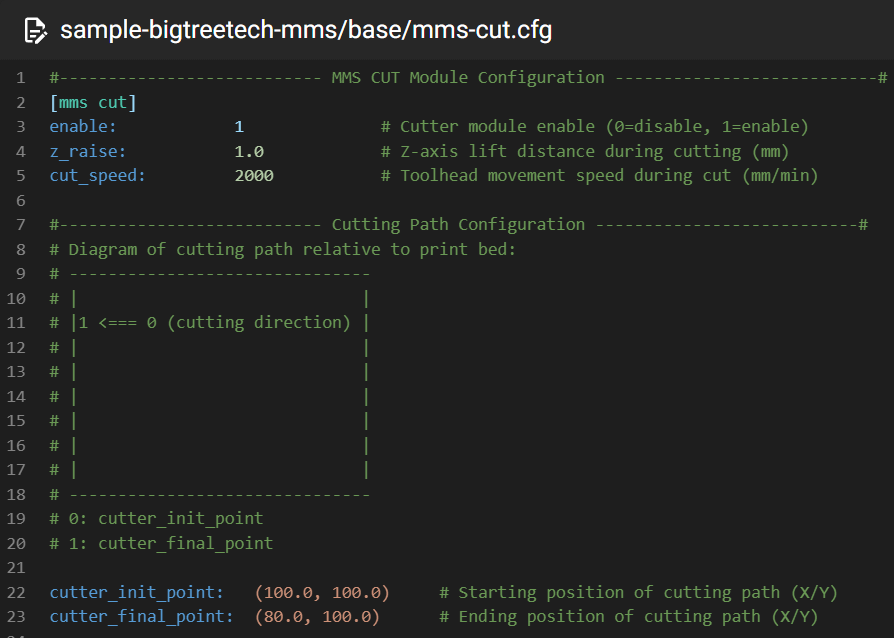

Moves the toolhead to a fixed cutter position to cut the filament.

* enable: Enables or disables the cutter module
* z_raise: Lifts the Z-axis before manual MMS_CUT command, then returns it to the original height afterward.

   *Note:* This setting only applies to manual MMS_CUT. During automatic filament changes, Z‑axis movement is controlled by the [mms swap] section.

* cutter_init_point: Toolhead position before cutting (set this to the actual coordinates for your printer)
* cutter_final_point: Toolhead position after cutting completes (set  this to the actual coordinates for your printer)
* cut_speed: Travel speed of the toolhead from `cutter_init_point` to `cutter_final_point`.


### base/mms-motion.cfg

#### [mms delivery]

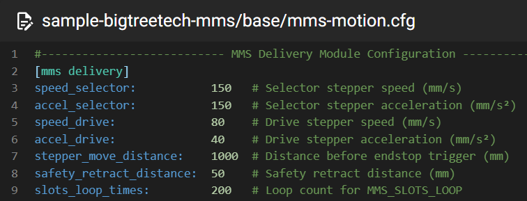

* speed_selector: Movement speed of the selector motor. The transmission distance in `mms-stepper.cfg` is 360/2.5 = 144mm/revolution, so the default 150mm/s ≈ 1.04 revolutions/second.
* accel_selector: Acceleration of the selector motor.
* speed_drive: Movement speed of the drive motor. The transmission distance in `mms-stepper.cfg` is 360/43 ≈ 8.37mm/revolution, so the default 80mm/s ≈ 9.56 revolutions/second.
* accel_drive: Acceleration of the drive motor.
* stepper_move_distance: The maximum allowable single move distance for feeding or retracting between: `Inlet` to `Buffer`, or `Buffer` to `Extruder`. *If this distance is exceeded without the corresponding sensor being triggered, the operation is considered abnormal.*
safety_retract_distance: After the `Gate` sensor is released during retract from `Extruder` to `Buffer`, an additional retraction of `safety_retract_distance` is performed，moving the filament away from the `Gate` sensor and preventing false triggers caused by the sensor being near its `trigger/release` threshold.
* slots_loop_times: Specifies the number of self-test loops performed during an`MMS_SLOTS_LOOP`  command, where one loop consists of each slot feeding and retracting once.

#### [mms autoload]

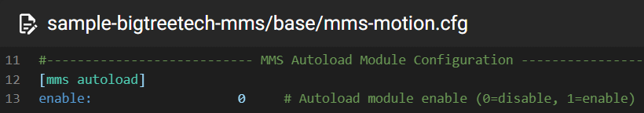

Automatically loads filament from a slot to the `Buffer` when the `Inlet` sensor triggers.

Disabled by default, it is only active when ViViD is idle and does not run during printing or other feed/retract operations.


#### [mms charge]

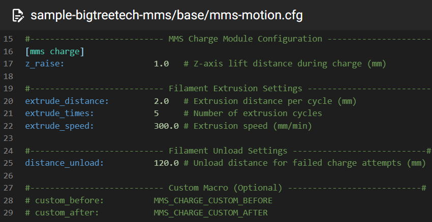

Ensures the filament is firmly engaged by the Extruder. Once the filament reaches the Extruder and triggers the Buffer outlet sensor, the Extruder extrudes `extrude_distance`; 

 If the outlet sensor releases, the charge is successful; otherwise, the process retries up to `extrude_times`. Failure after all retries results in a charge failure.

* z_raise: The Z-axis lift height applied before executing a manual MMS_CHARGE.
After the command completes, the Z-axis returns to its original height.

    This parameter only applies when manually executing the MMS_CHARGE command.
    
    The charge action during the filament change process does not apply this parameter for additional Z-axis raising; instead, the Z-axis is raised uniformly by the parameter in `[mms swap]`.

* extrude_distance: The length the Extruder extrudes during each attempt to grip the filament and release the Outlet sensor.
* extrude_times: The maximum number of extrusion attempts during a single charge operation.
* extrude_speed: The extrusion speed during charge attempts.
* distance_unload: The amount of filament retracted after a charge failure to release the Outlet sensor.
* custom_before: G-code executed before the charge operation, for custom actions.
* custom_after: G-code executed before the charge operation, for custom actions.

#### [mms eject]

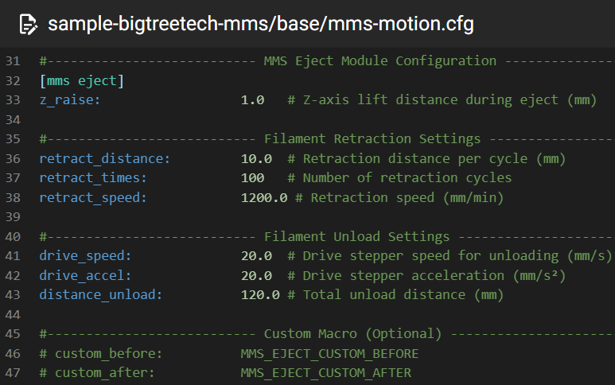

Ensures filament is fully removed from the Extruder.

* z_raise: The Z-axis lift height applied before executing a manual MMS_EJECT command.
After the command completes, the Z-axis returns to its original height.

    This parameter applies only to manual MMS_EJECT execution.
    
    During filament changes, the eject step does not apply this Z lift; Z-axis movement is handled uniformly by [mms swap].

* Extruder

    The Extruder retracts a distance to release the cut filament from the Extruder's gear. The total retraction distance will be divided into `retract_times` segments of `retract_distance`, meaning a maximum total retraction of `retract_times x retract_distance` length of filament. If the `ViViD` unloading logic completes earlier, the Extruder's retraction task will also stop early.


    * retract_distance: Extruder retracts a short distance
    * retract_times: Maximum number of Extruder retractions
    * retract_speed: Retraction speed of the Extruder (mm/min)

* ViViD

    After cutting, a short length of filament remains clamped in the Extruder gears. To return the filament to the Buffer, ViViD and the Extruder retract simultaneously: The Extruder releases the filament from its gears； ViViD pulls the released filament away from the Extruder.

    To ensure reliable operation, `drive_speed` must be lower than `retract_speed`. *Note: `drive_speed` is in mm/s, while `retract_speed` is in mm/min—convert units before comparing.*

    * drive_speed: ViViD retraction speed (mm/s)
    * drive_accel: ViViD retraction acceleration
    * distance_unload: Length of filament ViViD pulls away from the Extruder

* custom_before: G-code executed *before* the eject operation, for custom actions.
* custom_after: G-code executed *after* the eject operation completes, for custom actions.

#### [mms swap]


* enable: This setting does not disable the `custom_before` and `custom_after` commands, so we can use it to disable the default swap filament change process and implement a `custom filament change` workflow using scripts.

* z_raise: The height the Z-axis raises before filament change. After the filament change is complete, the Z-axis will return to its original height.

* command_string: The name of the filament change gcode command. The default `T` means the gcode commands will be `T0`, `T1`, `T2`, `T3`, etc. **Do not modify this setting unless you clearly understand what it means.**

* safe_mode: Adds M400 logic after each G1 movement command to ensure the current move is complete before proceeding to the next action. **Do not modify this setting unless you clearly understand what it means.**

* toolhead_move_speed: The movement speed of the toolhead.

* custom_before: G-code commands to execute *before* the swap, for custom actions.

* custom_after: G-code commands to execute *after* the swap is complete, for custom actions.


### base/mms-purge.cfg

#### [mms purge]

Cleans residual filament from the nozzle and cutter area after loading new material. This process flushes out old filament from the nozzle. Additional purging can be performed to avoid color mixing between old and new filament.


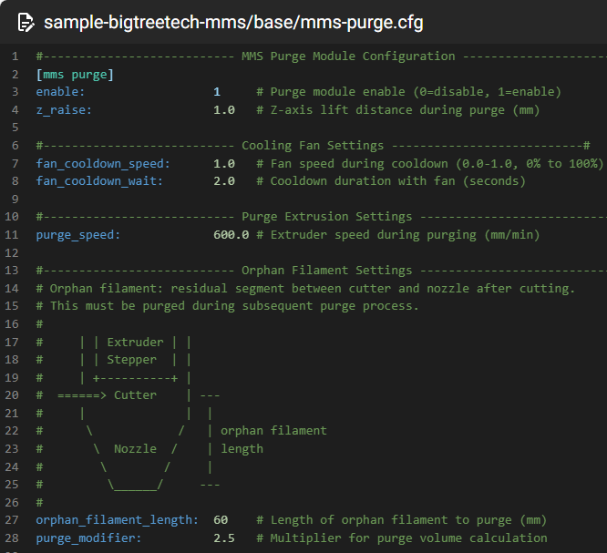

* enable: Only disables the purge distance set by `orphan_filament_length` and  `purge_modifier` .
* z_raise: The height the Z-axis raises before executing PURGE, MMS_PURGE, MMS_TRAY, or MMS_TRAY_EJECT actions. After command completion, the Z-axis will return to its original height.

    This parameter only applies when manually executing the MMS_EJECT command.
    
    The purge action during the filament change process does not apply this parameter for additional Z-axis raising; instead, the Z-axis is raised uniformly by the parameter in `[mms swap]`.

* fan

    Must configure [[fan]](https://www.klipper3d.org/Config_Reference.html#fan)

    * fan_cooldown_speed: Fan speed after purging old filament. This cools the residual material on the nozzle for easier removal with a brush.

    * fan_cooldown_wait: Wait time (in seconds) after the fan starts to cool the filament.

* purge
    * purge_speed: Extrusion speed for the extruder when purging old filament.
    * orphan_filament_length: The estimated length of old filament remaining in the system.
    * purge_modifier: Purge multiplier for old filament.

        The actual purge length is `orphan_filament_length * purge_modifier` ， which defaults to `60 *2.5 = 150mm`。
        
        The design intent of `purge_modifier` is: While the length of old filament remaining from the cutter to the nozzle is the same, dark colors should require more purging than bright colors, as dark colors are more prone to color mixing. Therefore, we should only need to set a uniform `orphan_filament_length`, then dynamically calculate an appropriate `purge_modifier` based on the old filament's color to minimize waste while ensuring no color mixing. While designed for dynamic adjustment, `purge_modifier` is currently implemented as a fixed value. 
        
        You do not need to modify it at this time. Rather, focus on setting an appropriate `orphan_filament_length` for your printer setup.

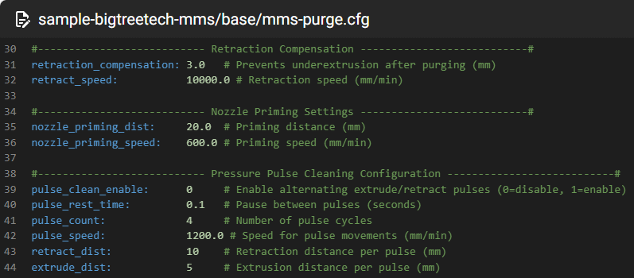

* Retraction
    * retraction_compensation: After purging old filament, quickly retract a short distance to minimize melted filament flowing out of the nozzle. This parameter should match or be slightly more than the `retraction when switching material` parameter in your slicer. For example, in OrcaSlicer, this setting is located at `Printer settings-> Extruder -> Retraction when switching material -> length`.
        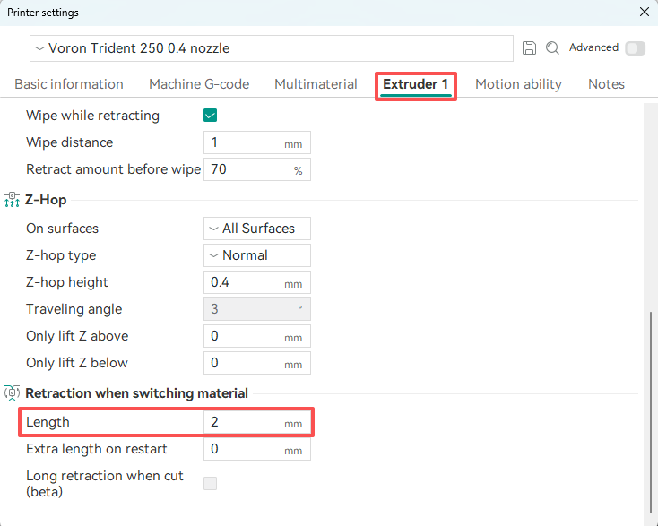
    * retract_speed: Speed of the quick retraction.
* Nozzle Priming
    * nozzle_priming_dist: When purging old filament is disabled using enable, this parameter is automatically activated to directly extrude a fixed length of filament.

        After disabling old filament purging, new filament still needs to be extruded an additional distance to compensate for the gap that still exists between new and old filament after loading is complete.
    * nozzle_priming_speed: Extrusion speed for the filament.
* Pressure Pulse Cleaning

    Before ejecting filament, the extruder performs repeated "extrude/retract" cycles to clean the heatbreak, preventing scattered filament residue from carbonizing. This also reduces waste filament that could ooze onto the build plate.

    * pulse_clean_enable: Enable/disable this feature.
    * pulse_rest_time: Pause wait time (in seconds) between each "extrude/retract" cycle.
    * pulse_count: Number of "extrude/retract" cycles.
    * pulse_speed: Speed of "extrude/retract" movements.
    * retract_dist: Length of "retraction". In principle, `retract_dist` should be greater than `extrude_dist`.
    * extrude_dist: Length of "extrusion".

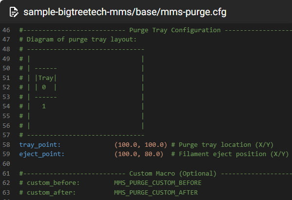

* tray_point: Coordinate position where the toolhead parks during purge process.
* eject_point: Has no meaning in the current version; no need to modify this setting.
* custom_before: G-code commands to execute *before* purge, for custom actions.
* custom_after: G-code commands to execute *after* purge is complete, for custom actions.

#### [mms brush]

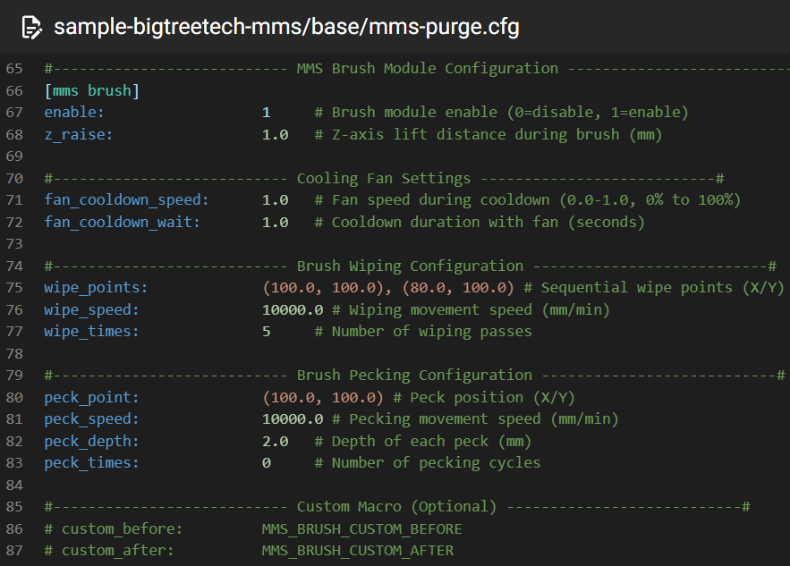

Moves the toolhead to a fixed location (where a brush is located) and moves the nozzle back and forth across the brush to clean it.

* enable: This setting does not disable the `custom_before` and `custom_after` commands, so we can use it to disable the default brush process and implement a `custom nozzle cleaning` workflow using scripts.
* z_raise: The height the Z-axis raises before executing BRUSH, MMS_BRUSH, MMS_BRUSH_WIPE, or MMS_BRUSH_PECK actions. After command completion, the Z-axis will return to its original height.

    This parameter only applies when manually executing the MMS_EJECT command.
    
    The brush action during the filament change process does not apply this parameter for additional Z-axis raising; instead, the Z-axis is raised uniformly by the parameter in `[mms swap]`.
* fan

    Must configure [[fan]](https://www.klipper3d.org/Config_Reference.html#fan)

    * fan_cooldown_speed: Fan speed *before* brushing the nozzle. This cools the residual material on the nozzle for easier cleaning.
    * fan_cooldown_wait: Wait time (in seconds) after the fan starts to cool the filament.
* wipe

    Brush the nozzle.
    * wipe_points: Coordinate values for toolhead movement when cleaning the nozzle (coordinates where the brush is located).
    * wipe_speed: Toolhead movement speed during the wiping action.
    * wipe_times: Number of back-and-forth passes the toolhead makes between the wipe_points when cleaning the nozzle.
* peck 

  Tap the nozzle on the brush a few times for further cleaning. Since the brush needs to raise/lower along the Z-axis together with the toolhead, this feature has minimal effect and is not recommended to be enabled.
    * peck_point: Coordinates of the brush's center point where the nozzle parks and moves up and down on the Z-axis for further cleaning.
    * peck_speed: Speed of Z-axis up-and-down movement.
    * peck_depth: Distance of Z-axis up-and-down movement.
    * peck_times: Number of Z-axis up-and-down movements.
* custom_before: G-code commands to execute *before* brush, for custom actions.
* custom_after: G-code commands to execute *after* brush is complete, for custom actions.


### hardware/mms-slot.cfg

#### [mms slot xxx]

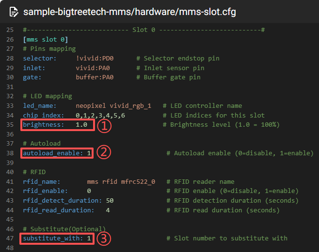

* `1: brightness`: Configurable RGB brightness, where 1.0 represents 100% brightness.
* `2: autoload_enable`: After enabling `mms autoload` in base/`mms-motion.cfg`, this setting allows the corresponding slot to be individually "enabled" or "disabled" for the automatic loading feature.
* `3: substitute_with`: After enabling `slot_substitute_enable` in `mms/mms.cfg`, the corresponding slot needs to set this configuration. `During printing`, when the filament in this slot runs out  (inlet not triggered), printing will automatically continue using the filament from the slot specified in this configuration.

    **For example**, in the diagram, slot0's substitute_with is set to 1. So `during printing`, when slot0's filament runs out, it will automatically load filament from slot1 to continue printing.

